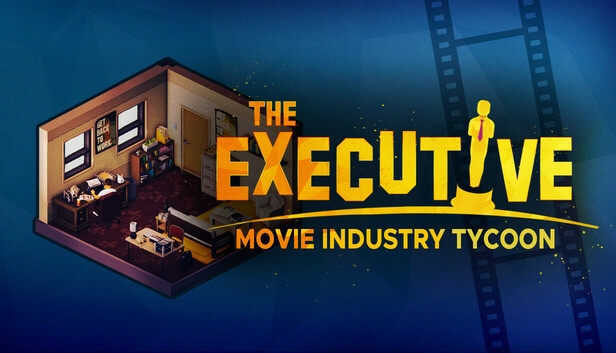

# Movie Industry Analysis – Phase 2 Project

## Team Members
- Dennis Muriungi
- Shem Omondi
- Valary Kones
- Jasho Kiplangat

## Project Overview
Our company is expanding into the film industry and plans to establish a new movie studio. With no prior production experience, the studio must understand what drives film success — whether measured by ratings, profitability, or audience reception — in order to make strategic production and investment decisions.

This project uses descriptive data analysis and visualization to explore trends in the movie industry from multiple datasets, including IMDb, Rotten Tomatoes, The Numbers, and Box Office Mojo.

The analysis answers three key business questions:

Genre & Ratings: Which movie genres receive the highest audience ratings?

Genre & Profitability: Which genres are most profitable relative to production costs?

Budget & Revenue: How do production budgets relate to box office performance?

After data cleaning, transformation, and visualization, we identify patterns that guide recommendations for the new studio’s investment strategy.


## Business Problem


The studio’s challenge is to determine what makes movies successful. Success can be defined differently — by high audience ratings, strong profitability, or both. Our goal is to use historical movie data to identify:

Genres with consistently high audience ratings.

Genres that deliver the highest profitability (ROI).

The relationship between production budgets and box office earnings.

These insights will help the studio allocate resources effectively and reduce financial risk in its early productions.

## Data Access
Due to file-size limits, raw data are not on GitHub.  
Download from our shared Google Drive folder: [(https://drive.google.com/drive/folders/1FbXRC3MHiQnwekuqBYZycVzhuZCX6jRF?usp=drive_link)].  
Place all files inside the `data/` directory before running notebooks.

## Methods
 * Data Cleaning
    * Merged datasets from IMDb, Rotten Tomatoes, and Box Office Mojo into a unified dataframe.

    * Cleaned monetary columns (removed $ and ,), converting them to numeric types.

    * Handled missing data and removed duplicate records.

    * Mapped genre_ids to genre names for interpretability.

 * Calculated new columns:

    * Profitability: (worldwide_gross - production_budget) / production_budget

    * Main Genre: Extracted from the first genre ID.

 * Data Visualization

We created visualizations to answer our key research questions:

* Average ratings by genre

* Average profitability by genre

* Relationship between production budgets and     worldwide box office revenue

## Results

* How do genres perform by Ratings
History and Music films have the highest average ratings, while TV Movies and Westerns receive the lowest.


* How do genres perform by Profitability
Horror and Family films are the most profitable genres, often delivering high returns despite modest production budgets.


* How do production budgets relate to box office revenue
There is a strong positive relationship between budget and revenue(0.75) — larger budgets tend to yield higher box office returns. However, the correlation is not perfect, suggesting that spending more does not guarantee profitability.


## Conclusions
1. Prioritize Profitable Genres

Invest in Horror, Family, and Adventure films. Horror offers exceptional ROI on low-budget projects, while Family and Adventure films reliably combine audience appeal with strong financial performance.

2. Balance Budget and Risk

High-budget productions (e.g., Action, Sci-Fi) can achieve large box office returns, but careful budgeting and ROI management are essential. Diversifying the portfolio between high- and low-budget films reduces financial risk.

3. Data-Driven Production Strategy

Focus on films with proven audience approval (high ratings) and profitability. Combining top-rated genres with strategic investment in low-risk, high-return projects will maximize both studio reputation and revenue potential.

## Project Limitations & Recommendations

1. Genre Analysis: Only the primary genre was considered for each film, which may overlook multi-genre influences on ratings and profitability.

2. Incomplete Financial Metrics: Marketing costs and inflation adjustments were not included, so profitability estimates may not fully reflect true ROI.

3. Scope of Data: The datasets primarily cover mainstream films; independent, international, or non-English films may exhibit different patterns and should be analyzed in future studies.


## Repository Structure

```
├── data/
├── notebooks/
│   ├── dennis.ipynb
│   ├── shem.ipynb
│   ├── vkones.ipynb
│   ├── main.ipynb
│   └── jasho.ipynb
├── output/
│   ├── Average Movie ratings by Genre.png
│   ├── Average Profitability by Genre.png
│   ├── Production Budget vs Box Office Revenue.png
│   └── Tycoon.jpg
├── .gitignore
└── README.md


